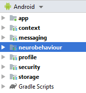

# HELIOS TestClient #

This is a test client Android application utilizing HELIOS Core
modules. The application implements group chat functionality
demonstrating the use of different HELIOS Core APIs. The repository
can be built using Android Studio (3.5.x).

## Notes about this branch ##

Helios Neurobehaviour module works with TestClient app (app + modules) with the purpose of integrate callings to Neurobehaviour module when the user interacts with Helios chat.

In order to test all features of Neurobehavioral module, some files of TestClient app have been modified in this branch.

This version of TestClient contains the next modifications:

    * Permission to use system sensors in AndroidManifest.xml
    * Calls to Neurobehaviour module into TestClient activities
    * New feature to use mobile camera to send a picture
    * Feature to save audio messages

Please see [readme file of Neurobehaviour module] (https://scm.atosresearch.eu/ari/helios_group/neurobehaviouralclassifier/blob/master/doc/contents-analysis.md) for details about module integration.
    
Neurobehaviour module uses deep learning models to extract a sentimental analysis of images. This module uses a wrapper to be able to use Python scripts in Android's AAR.

To use Python wrapper feature, please edit your <b>local.properties</b> file and add:

    chaquopy.license=ADCOZh9lSwXa7BArj2j1gni5JznpJJWNZ6nbNhR9FTLx
	chaquopy.applicationId=eu.h2020.helios_social.heliostestclient
    

